# L4 individual project
# Using Deep Learning to predict overall survival times for breast cancer from H&E stained whole slide images. 
## By - Anirbit Ghosh, Supervisor - Dr. Kevin Bryson

This repository holds the main source code for my individual project. It additionally contains the meeting notes, logs, presentation and dissertation. The data used in the project was too large to be stored here. Instead, we have included the links to the original online sources for the model training data and the TCGA data used for regression (more detail in the folder [README](data/README.md)). This project was supervised by Dr. Kevin Bryson. 

---
The final disseration (in PDF) can be viewed and downloaded from here: [Dissertation PDF](dissertation/2439281g.pdf). All LaTeX source files can be found in [dissertation](dissertation) folder. 

---

# Project Aim
The project's overall goal was to investigate the viability of biopsy slide images in estimating the overall survival time of breast cancer patients. We achieved this by splitting the project into two high level tasks:
- ### Diagnostic stage: 
Training a machine learning model to classify a given patch of breast tissue as malignant or benign. When applied to an entire whole slide image, it output a fully segmented tumour map indicating all regions of malignancy. We generate a discrete binary output (0 or 1) and a continuous malignant probability output. These prediction results are used to calculate Malignancy Spread Score and Mean Malignant Intensity. These are the two covariates used to characterize cancer severity in a given slide image and used in survival modeling. 
- ### Prognostic Stage:
We utilized the scores extracted from the whole slide images using our machine learning model to fit two univariate Cox proportional hazard models. We also used each sample's actual survival duration as the ground truth value to fit our semi-parametric linear regression models. Finally we query our fitted model with a calculated value of the associated covariate to obtain a median survival time. We have then evaluated the fitted hazard models and the generated predictions against actual clinical data to determine the root mean square error and distribution of errors for each model. 

---
## Diagnostic stage
- ### Model architecture: 
We have implemented a deep convolutional neural network based on the state-of-the-art ConvNet architecture. The model can be found here: [CNN implementation](src/models/custom_network.py)

- ### Data pre-processing:
    - Our training data was pre-tiled with tile-level annotations. So our model learned how to classify metastases from 96x96px tiles at a 4x magnification to increase FOV. 
    - WSIs to be processed by our trained model to extract features for survival regression, were tiled into 96x96px patches using OpenSlide. 
    - We filtered out tiles based on a maximum intensity and minimum std deviation threshold to remove any background tiles to reduce overall sample space and increase processing speeds. 
    - WSIs are manually prepared and show different degrees of stain variability. So we have implemented a Macenko normalization process to normalize the stain profile of each tile. This prevents any visual differences caused by stain variability from being learned by our model and causing overfitting. Normalizing all images to the same colour profile enables better and more consistent learning. 
---

- ### Model training:
We implemented a supervised learning process to train our CNN. Since WSIs are too massive, we opted for a tile-wise processing approach. However, finding strongly annotated breast cancer data was a problem as it is a very manually intensive process and we could not hire a specialized pathologist to help prepare our own dataset. Therefore, we have utilized the only publicly available, annotated breast cancer WSI data - the [PatchCamelyon](https://github.com/basveeling/pcam) dataset (a derivative of the Camleyon16 data). This was used to train our model to identify areas of breast metastases in tissue samples. Camelyon data contains annotated patches of breast metastases found in sentinel lymph node tissue. This led to one of the major assumptions of our project, **can the knowledge of breast metastases in lymph nodes be transferred to identify malignant tumours in breast tissue.** This was a point of concern as there is no existing literature on similar training methods. However, our project proved that this does work reasonably well as our model was able to effectively predict specific regions of malignancy in every breast tissue WSI provided. 

- ### Classification validation
We internally validated our trained model against the validation data of the PCAM dataset. The results showed 70% accuracy for our model, but it was validated against lymph node tissue which isn't relevant to our task. The confusion matrix containing the prediction results on the PCAM validation dataset is shown below:

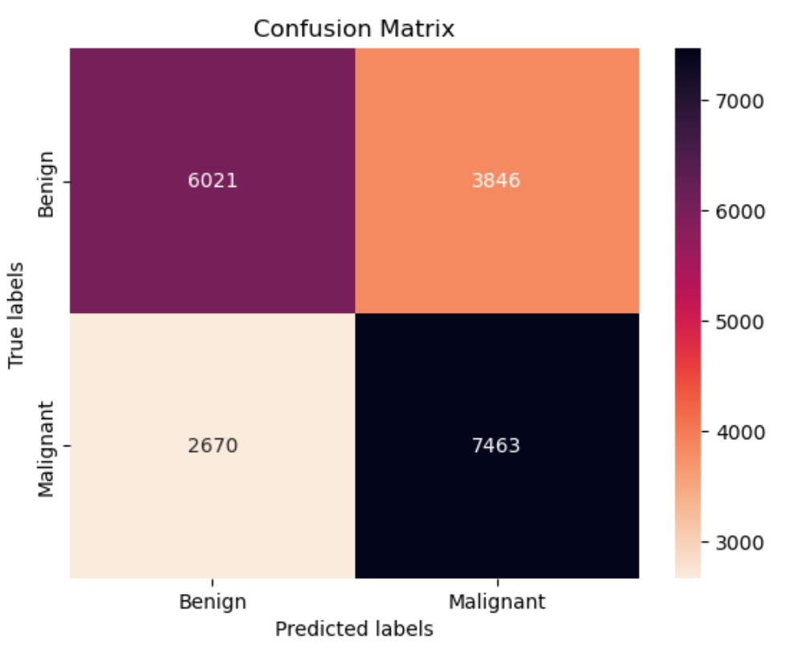

For survival regression, we curated a dataset a 74 WSIs sourced from [TCGA](https://portal.gdc.cancer.gov/repository?filters=%7B%22op%22%3A%22and%22%2C%22content%22%3A%5B%7B%22content%22%3A%7B%22field%22%3A%22files.cases.primary_site%22%2C%22value%22%3A%5B%22breast%22%5D%7D%2C%22op%22%3A%22in%22%7D%2C%7B%22op%22%3A%22in%22%2C%22content%22%3A%7B%22field%22%3A%22files.data_type%22%2C%22value%22%3A%5B%22Slide%20Image%22%5D%7D%7D%5D%7D). However, these samples are not annotated and so we could not quantitatively validate our trained model's performance on breast tissue. However, qualitative evaluation showed results that capture the relative metastases severity very accurately. We have plotted some prediction results along with the sample's associated survival time. As we can observe, the model predicts very severe metastases for cases with low survival time and relatively mild metastases for cases with high survival time. This trend provided a degree of validation towards our model working successfully on breast tissue despite being trained on lymph node tissue. 

Malignancy Spread Score (binary prediction)             |  Mean Malignant Intensity (probability prediction)
:-------------------------:|:-------------------------:
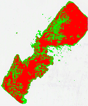  |  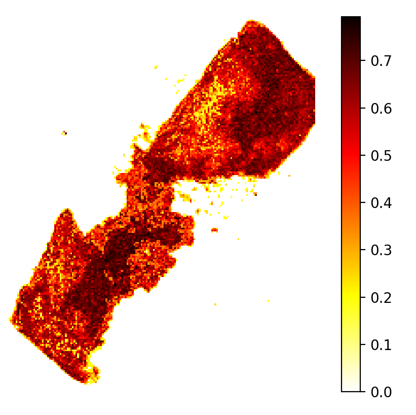

survival time: 6.47 months

---

Malignancy Spread Score (binary prediction)             |  Mean Malignant Intensity (probability prediction)
:-------------------------:|:-------------------------:
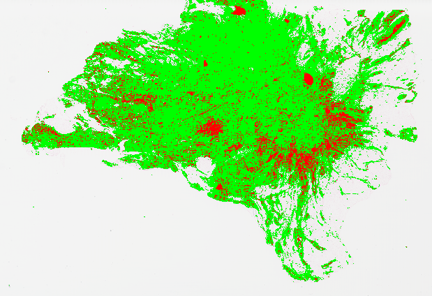  |  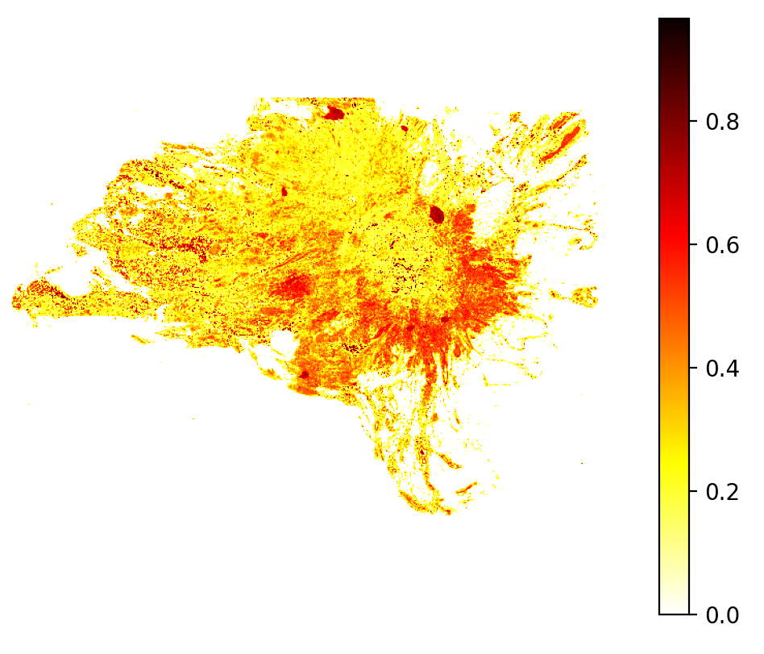

survival time: 128.98 months

---
Malignancy Spread Score (binary prediction)             |  Mean Malignant Intensity (probability prediction)
:-------------------------:|:-------------------------:
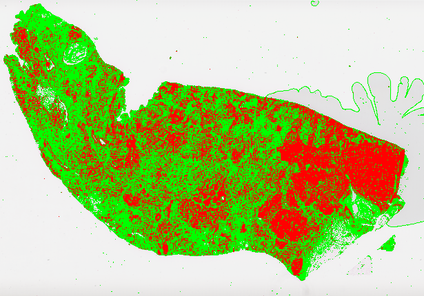  |  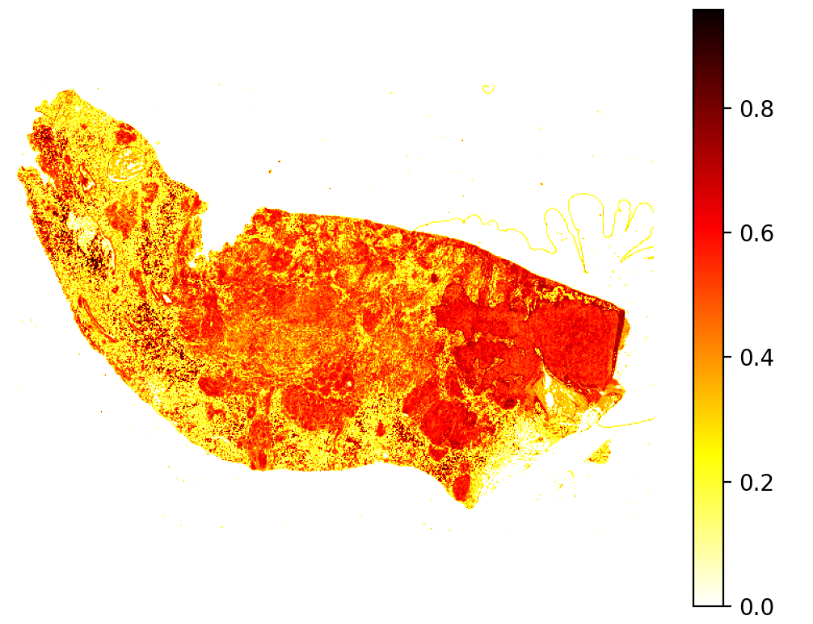

survival time: 11.99 months

---
Malignancy Spread Score (binary prediction)             |  Mean Malignant Intensity (probability prediction)
:-------------------------:|:-------------------------:
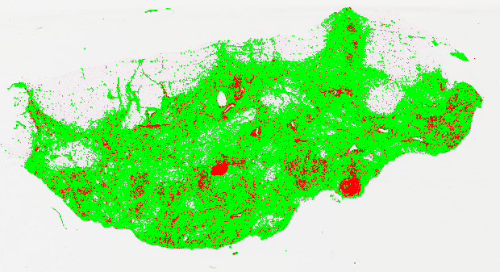  |  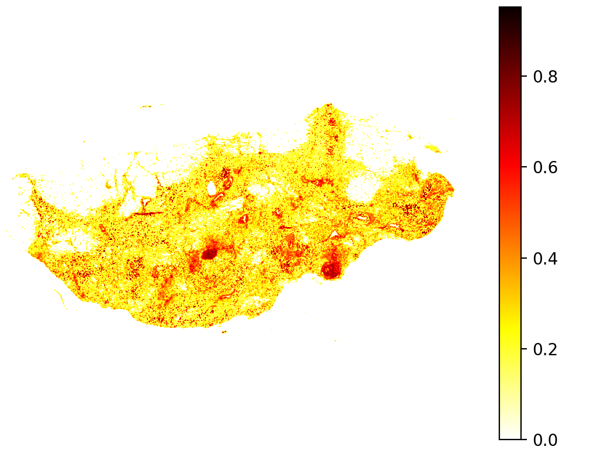

survival time: 140.18 months

---

## Prognostic Stage

- ### Survival models
We have fitted two univariate Cox Hazard model for each covariate extracted from the 74 TCGA WSI dataset by our trained metastases detection model. We also retrieved each patient's actual survival duration from [CBioPortal](https://www.cbioportal.org/) using their TCGA patient ID. These survival durations were used as ground truth to fit the regression models. We then use the Kaplan Meier survival function to predict a median survival time for each patient. 

- ### Model evaluation
Cox models for both covariates showed a positive Hazard Ratio indicating both image-based features represent a risk factor, negatively effecting survival. However, only one covariate, the Mean malignant intensity showed statistical significance with a p-value < 0.05 (p = 0.02) whereas the malignancy spread score covariate had a p-value of 0.08. MMI also showed a higher z-value of 2.25 and a higher hazard ratio of 30.20 compared to 1.76 and 2.78 respectively for the MSS covariate. This indicated MMI characterizes a much stronger influence on disease hazard and patient survival. The 95% confidence intervals for each covariate indicated that the MSS covariate does not fully reject the null value of HR = 1 (log(HR) = 0) such that the covariate may have no effect at all on patient survival. Whereas, despite having a much wider range leading to greater uncertainty in hazard estimation, the MMI covariate rejects the null value and has a significant effect on patient survival. 

- ### Survival time prediction performance
We have performed a 5 fold cross validation due to the limited patient WSI data. We fitted the Cox models on 4 folds, predicted median survival time on the held out fold and calculated the RMSE compared to the associated ground truth. We then calculated the mean RMSE across all 5 folds and also the associated std deviation to measure the distribtuion of errors.

Covariate           |  Mean RMSE (months) | Std deviation (months)
:-------------------------:|:-------------------------:|:-------------------------:
MMI | 47.07 | 29.02
MSS | 47.12 | 29.00

We also plotted the relationship between predicted survival time and actual survival duration of each patient sample in our 74 WSI dataset as shown below. Overall, the predictions are very erroneous with high RMSE showing large deviations from the actual values. This indicates the correlation between WSI features and survival is not very strong to accurately estimate patient survival. Disease hazard is influenced by multiple external factors which a univariate model, that uses no clinical data, cannot effectively characterize. Thus, the base hazard is incomplete and unable to scale effectively for the different covariates of each patient. However, the graph shows our model was able to capture the intra-sample survival trends accurately, such that samples with higher survival were predicted a relatively higher survival time compared to samples with lower survival. This indicates, our covariates do capture malignant severity to an extent which has a minor, albeit meaningful, effect on patient survival. 

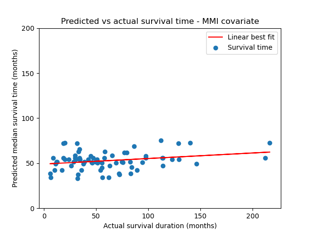

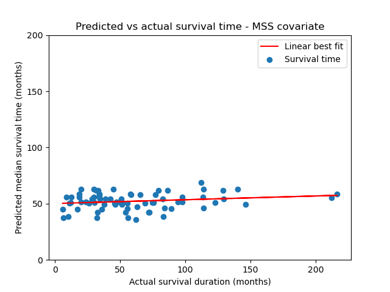

